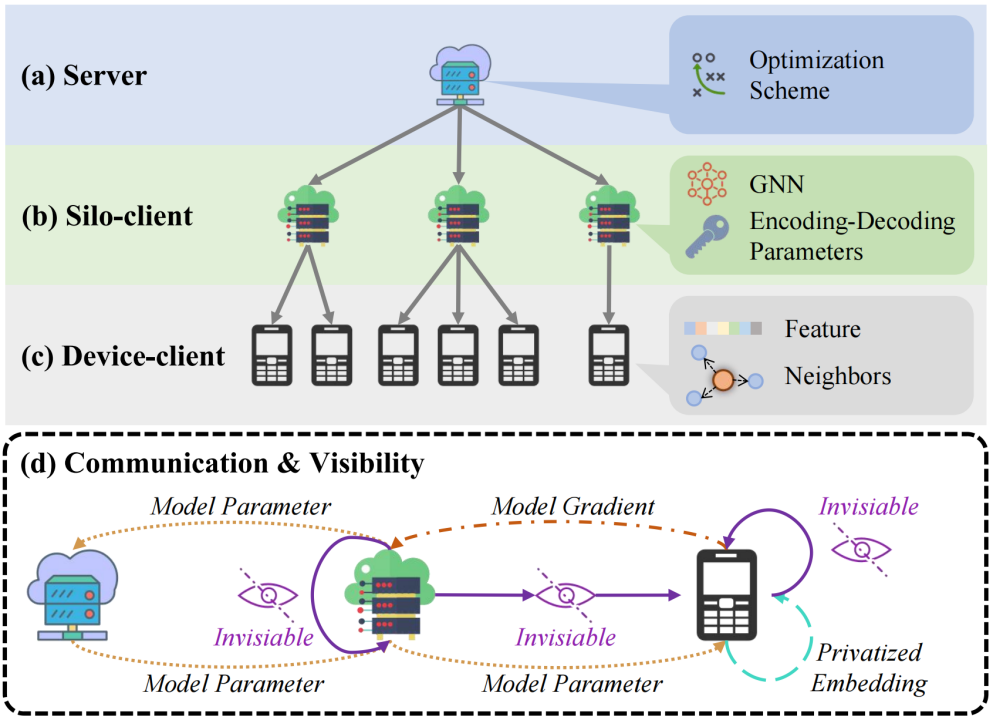

# HiFGL: A Hierarchical Framework for Cross-silo Cross-device Federated Graph Learning

This is the official repository of the KDD'2024 Research Track Paper ["HiFGL: A Hierarchical Framework for Cross-silo Cross-device Federated Graph Learning"](https://dl.acm.org/doi/10.1145/3637528.3671660) ([Preprint](https://arxiv.org/abs/2406.10616)).

### Introduction

Federated Graph Learning (FGL) has emerged as a promising way to learn high-quality representations from distributed graph data with privacy preservation. Despite considerable efforts have been made for FGL under either cross-device or cross-silo paradigm, how to effectively capture graph knowledge in a more complicated cross-silo cross-device environment remains an under-explored problem. However, this task is challenging because of the inherent hierarchy and heterogeneity of decentralized clients, diversified privacy constraints in different clients, and the cross-client graph integrity requirement. To this end, in this paper, we propose a Hierarchical Federated Graph Learning (HiFGL) framework for cross-silo cross-device FGL. Specifically, we devise a unified hierarchical architecture to safeguard federated GNN training on heterogeneous clients while ensuring graph integrity. Moreover, we propose a Secret Message Passing (SecMP) scheme to shield unauthorized access to subgraph-level and node-level sensitive information simultaneously. Theoretical analysis proves that HiFGL achieves multi-level privacy preservation with complexity guarantees. Extensive experiments on real-world datasets validate the superiority of the proposed framework against several baselines. Furthermore, HiFGL's versatile nature allows for its application in either solely cross-silo or cross-device settings, further broadening its utility in real-world FGL applications.

<p align="center">
  
</p>

### Requirements

- Python 3.8
- PyTorch 1.10
- PyTorch Lightning 1.5.3
- TorchMetrics 0.6

### Run

An example that appoints dataset with `cora` and epochs with `64`.

```
python ./code/main.py -D cora -E 64
```

### Citation

```
@article{guo2024hifgl,
  title={HiFGL: A Hierarchical Framework for Cross-silo Cross-device Federated Graph Learning},
  author={Guo, Zhuoning and Yao, Duanyi and Yang, Qiang and Liu, Hao},
  journal={arXiv preprint arXiv:2406.10616},
  year={2024}
}
```

```
@inproceedings{10.1145/3637528.3671660,
  author = {Guo, Zhuoning and Yao, Duanyi and Yang, Qiang and Liu, Hao},
  title = {HiFGL: A Hierarchical Framework for Cross-silo Cross-device Federated Graph Learning},
  year = {2024},
  isbn = {9798400704901},
  publisher = {Association for Computing Machinery},
  address = {New York, NY, USA},
  url = {https://doi.org/10.1145/3637528.3671660},
  doi = {10.1145/3637528.3671660},
  abstract = {},
  booktitle = {Proceedings of the 30th ACM SIGKDD Conference on Knowledge Discovery and Data Mining},
  pages = {968–979},
  numpages = {12},
  keywords = {federated graph learning, graph neural network, multi-level privacy preservation},
  location = {Barcelona, Spain},
  series = {KDD '24}
}
```